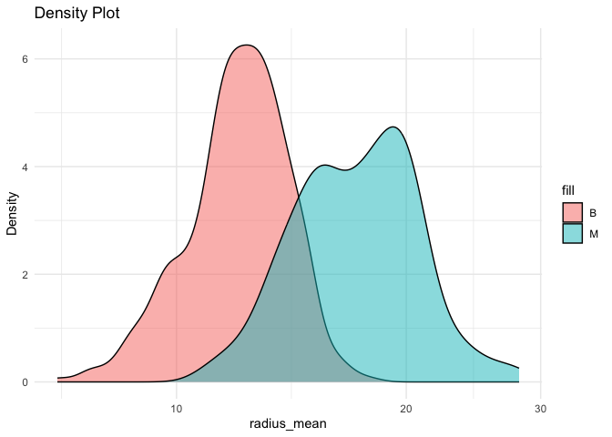

Density Plot Package
================
Weiya Zhu
2023-11-07

## Density Plot

The AssignmentB2 package provides an efficient way to create a density
plot through the `density_plot` function. It creates a density plot with
alpha=0.5 based on the given inputs, dataset, x, and fill values, using
ggplot2. This package can be used as a visualization tool to represent
the distribution of a continuous numeric variable (x) across multiple
fills(categorical values).

## Installation

You can install the development version of Density Plot with the
following instructions:

``` r
devtools::install_github("stat545ubc-2023/assignment-b2-Weiya818")
```

    ## Downloading GitHub repo stat545ubc-2023/assignment-b2-Weiya818@HEAD

    ## rlang     (1.1.1 -> 1.1.2) [CRAN]
    ## lifecycle (1.0.3 -> 1.0.4) [CRAN]
    ## utf8      (1.2.3 -> 1.2.4) [CRAN]
    ## fansi     (1.0.4 -> 1.0.5) [CRAN]
    ## ggplot2   (3.4.3 -> 3.4.4) [CRAN]

    ## Installing 5 packages: rlang, lifecycle, utf8, fansi, ggplot2

    ## Installing packages into '/private/var/folders/8j/hvsc33bn3yx9j55rcgnwlsfr0000gn/T/RtmpWOVCHg/temp_libpath392217219d9b'
    ## (as 'lib' is unspecified)

    ## 
    ## The downloaded binary packages are in
    ##  /var/folders/8j/hvsc33bn3yx9j55rcgnwlsfr0000gn/T//Rtmpd6oWup/downloaded_packages
    ## ── R CMD build ─────────────────────────────────────────────────────────────────
    ## * checking for file ‘/private/var/folders/8j/hvsc33bn3yx9j55rcgnwlsfr0000gn/T/Rtmpd6oWup/remotesea99176042d/stat545ubc-2023-assignment-b2-Weiya818-b80b3e4/DESCRIPTION’ ... OK
    ## * preparing ‘AssignmentB2’:
    ## * checking DESCRIPTION meta-information ... OK
    ## * checking for LF line-endings in source and make files and shell scripts
    ## * checking for empty or unneeded directories
    ## * building ‘AssignmentB2_0.1.0.tar.gz’

    ## Installing package into '/private/var/folders/8j/hvsc33bn3yx9j55rcgnwlsfr0000gn/T/RtmpWOVCHg/temp_libpath392217219d9b'
    ## (as 'lib' is unspecified)

## Usage

This is an example showing how to generate the density plot using this
package.

``` r
library(AssignmentB2)
density_plot(data = datateachr::cancer_sample, x = datateachr::cancer_sample$radius_mean, fill = datateachr::cancer_sample$diagnosis, x_axis_name = "radius_mean")
```

<!-- -->
